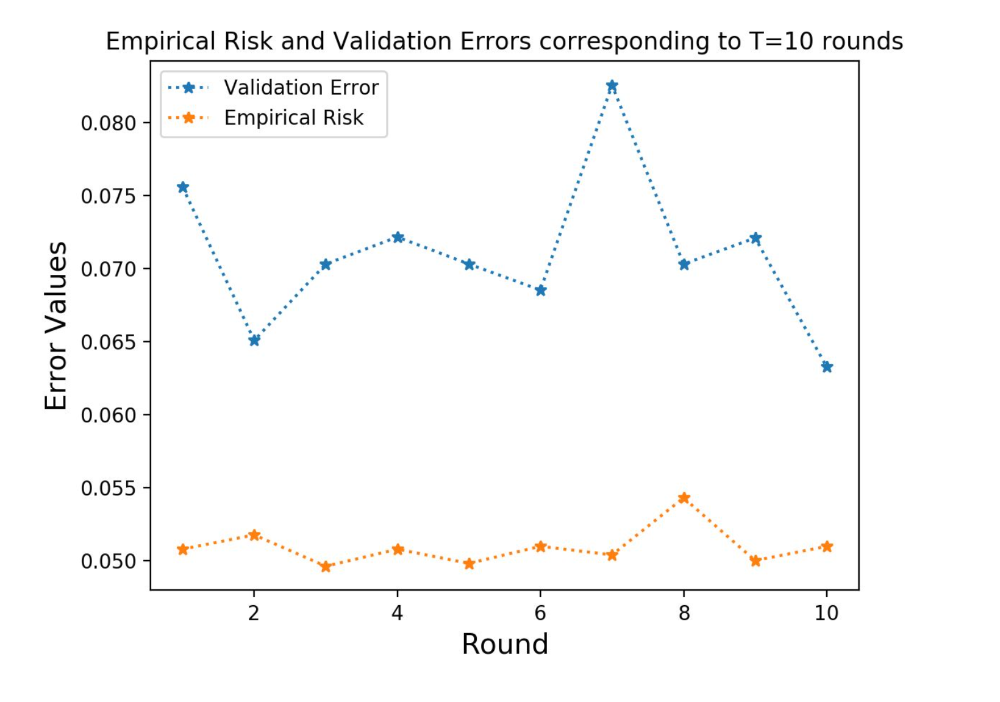
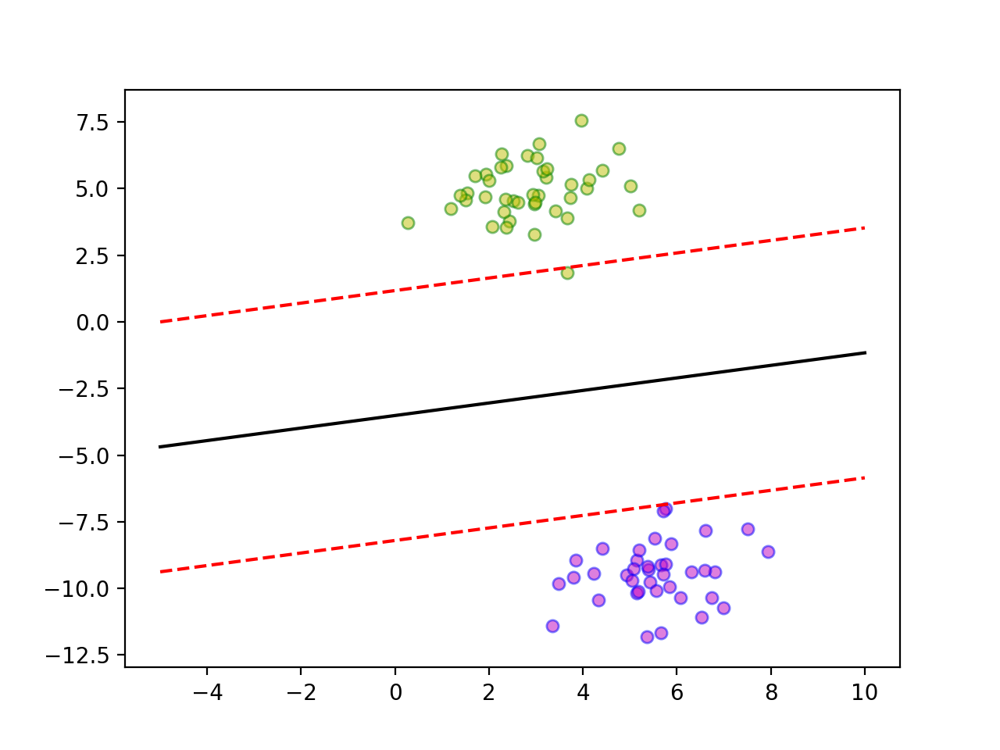

# Common ML Algorithms from scratch_Python3 (Learning Repository)

This repository consists the implementations of a few common ML Algorithms from scratch in Python3. The dataset used is the famous Breast Cancer Dataset (Breast_Cancer_Data). Observations are also made on a Linearly Separable Dataset (linearly-separable-dataset) in some cases.

The algorithms implemented are:
  - Perceptron Learning Algorithm (perceptron.py)
  - Adaptive Boosting Algorithm (adaBoost.py)
  - K Means Clustering Algorithm (kmeans.py)
  - K Nearest Neighbour Classifier (knn.py)
  - Support Vector Machine Classifier (svm.py)
  
### Perceptron Learning Algorithm (perceptron.py)
Datasets: linearly-separable-dataset.csv / Breast_cancer_data.csv
Modes: erm (For ERM Loss calculation) / crossvalidtf (For Cross Validation Loss Calculation)
Run following on command line mentioning the appropriate dataset file and mode: 

_python perceptron.py --dataset linearly-separable-dataset.csv --mode erm_

#### Observations/Comparison:
The algorithm stops after a reasonably small amount of time in case of the linearly separable dataset. Initially, it ran for a reasonable amount of time for the Breast Cancer Dataset. This is because the dataset unlike the previous one is not exactly linearly separable and thus the error of prediction cannot reach zero. In case of linearly separable dataset, the algorithm converges by nullifying the loss value (zero error). Thus, the heuristic that I adopted was to stop the algorithm when the error value becomes constant and stable in a way. As observed, in case of the Breast Cancer Dataset the algorithm stops when the error becomes constant, which takes reasonably less time.

### Adaptive Boosting Algorithm (adaBoost.py)
Dataset: Breast_cancer_data.csv
Modes: erm (For ERM Loss calculation) / crossvalidtf (For Cross Validation Loss Calculation)
Run following on command line mentioning the appropriate mode:

_python adaBoost.py --mode erm_

#### Observations:
The plot of empirical risk and Validation Errors corresponding to T values ranging from 1 to 10 has been shown in the figure below. As we can see, the Validation Error for all rounds is reasonably higher than the Empirical Risk values for the same rounds. This is due to the fact that the error on training data would be stable and less than that on the testing data, and the Empirical Error here corresponds to the error in the training data while the Validation Error corresponds to the error observed on the predictions made on the testing data.
Also, as can be seen in the plot, the algorithm on experimentation with different T values was found to reach an optimal accuracy after 10 rounds. Thus, I would recommend 10 rounds of boosting for this task based on my experimentations.

### K Means Clustering Algorithm (kmeans.py)
The code implemented allows to obtain clusters using the Euclidean distance and the Manhattan distance function. The distance metric can be chosen by passing appropriate metric choice as command line arguments. The analysis has been done for clustering with k=2. Also, the dataset features have been scaled to get better results.
Instructions to run  code with:

(a) Euclidean distance as the metric:

_python3 kmeans_hw4.py --dataset Breast_cancer_data.csv --metric 'euclidean'_
or 
_python3 kmeans_hw4.py --dataset Breast_cancer_data.csv_
(Euclidean metric is the default metric assigned)

(b) Manhattan distance as the metric:

_python3 kmeans_hw4.py --dataset Breast_cancer_data.csv --metric 'manhattan'_

Value of k take	n as 2.(line 71)

#### Observations: 
The clustering actually manages to approximately separate the patients based on the diagnosis.The initial centroid is taken randomly by shuffling. There are primarily 2 clusters with similar percentage values getting formed, the cluster numbers being interchangeable. But the performance is consistent in the sense that about 98% of one of the clusters always consists of positive diagnosis, with about 16% of the other cluster also belonging to positive diagnosis, i.e. about 83% of the other cluster contains negative diagnosis data. Also, this performance is roughly the same for both the metrics, Euclidean and Manhattan Distances respectively, thus maintaining consistency metric wise. The k means algorithm implemented provides a good rough estimation of the negative and positive diagnosis data by dividing them into two clusters. Even though the performance is not exceptionally good, it does provide a fair idea of the data distribution among the negative and positive diagnosis and thus would be good for initial analysis purposes.

### K Nearest Neighbour Classifier (knn.py)

Running instructions for the python file:

_python3 knn_hw3.py --dataset Breast_cancer_data.csv --num-epochs 100 --k 3_

##### Command Line Arguments description:
  - datatset: dataset file
  - num-epochs: number of epochs
  - k: value of k

##### Train Test Splitting:

In the main function, for each epoch, data is shuffled using np.random.shuffle() of numpy and then 80% data is used for training data and the rest 20% is used as test data.

##### Accuracy calculation:

Predicted values compared with test labels, and fraction of correctly predicted labels calculated.

##### Normalization:

Intially ran algorithm with no data normalization, resulted in less accuracy (around 88% for k=3, averaged for 100 epochs).
Upon normalization, accuracy increased to 91% for the same parameters. This is because earlier the distances measured for different dimensions were not scaled, normalization made these values comparable.

### Support Vector Machine Classifier (svm.py)

A Support Vector Machine (SVM) is a discriminative classifier formally defined by a separating hyperplane. In other words, given labeled training data (supervised learning), the algorithm outputs an optimal hyperplane which categorizes new examples. In two dimentional space this hyperplane is a line dividing a plane in two parts where in each class lay in either side.

Running instructions for the python file:

_python3 svm.py_

#### Observations:

Data Points taken for testing: 20 out of 100
Number of Data Points Misclassified: 0 [Accuracy = 100%] (Figure Below)

  
  
